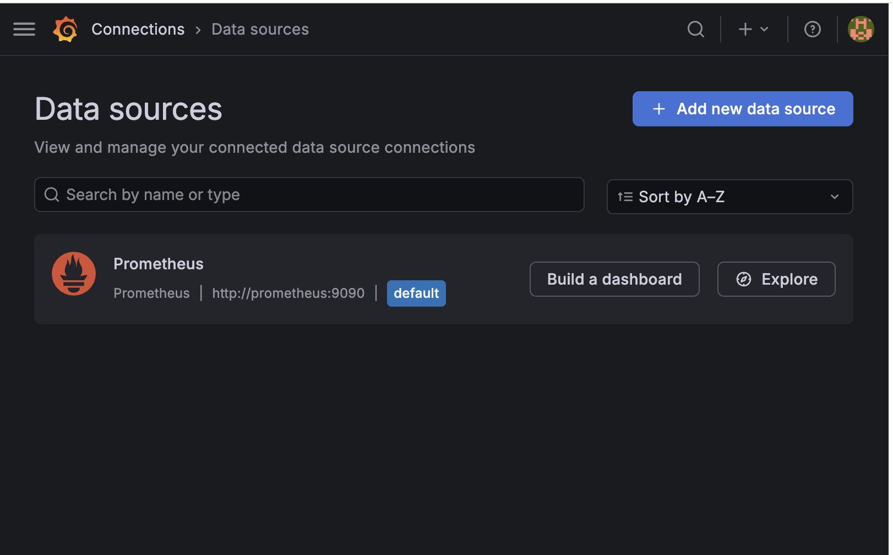
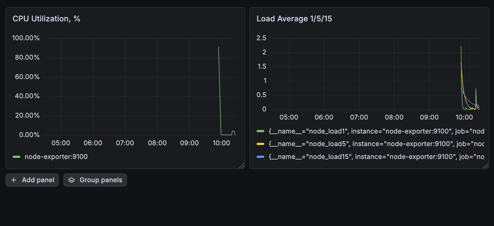
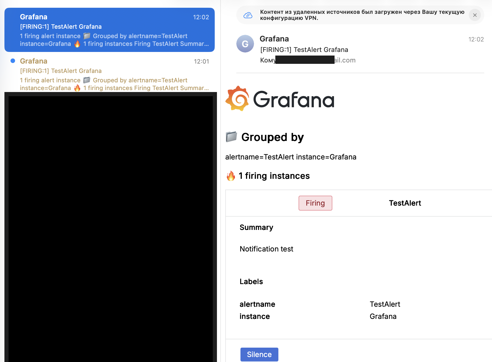

# Домашнее задание к занятию 14 «Средство визуализации Grafana»

## Описание стенда

Для выполнения домашнего задания была развернута виртуальная машина в Yandex Cloud.

На сервере были запущены следующие сервисы:

- Grafana;
- Prometheus;
- Node Exporter.

Prometheus используется как источник данных для Grafana.  
Node Exporter используется для сбора системных метрик с сервера.

Связка была запущена через `docker compose`.

---

## Используемые сервисы

| Сервис | Назначение | Порт |
|---|---|---|
| Grafana | Визуализация метрик и настройка alert-правил | 3000 |
| Prometheus | Хранение и обработка метрик | 9090 |
| Node Exporter | Сбор системных метрик Linux-сервера | 9100 |

---

## Структура проекта

```text
grafana-homework/
├── README.md
├── docker-compose.yml
├── dashboard-node-exporter.json
├── prometheus/
│   └── prometheus.yml
├── grafana/
│   ├── provisioning/
│   │   ├── datasources/
│   │   │   └── prometheus.yml
│   │   └── dashboards/
│   └── dashboards/
├── 1.1.png
├── 1.2.png
└── 1.3.png
```

---

# Задание 1

## Запуск связки Prometheus + Grafana + Node Exporter

Для запуска сервисов использовался файл `docker-compose.yml`.

```yaml
version: "3.8"

services:
  prometheus:
    image: prom/prometheus:latest
    container_name: prometheus
    restart: unless-stopped
    ports:
      - "9090:9090"
    volumes:
      - ./prometheus/prometheus.yml:/etc/prometheus/prometheus.yml:ro
      - prometheus_data:/prometheus
    command:
      - "--config.file=/etc/prometheus/prometheus.yml"
      - "--storage.tsdb.path=/prometheus"

  node-exporter:
    image: prom/node-exporter:latest
    container_name: node-exporter
    restart: unless-stopped
    ports:
      - "9100:9100"
    pid: host
    volumes:
      - /:/host:ro,rslave
    command:
      - "--path.rootfs=/host"

  grafana:
    image: grafana/grafana-oss:latest
    container_name: grafana
    restart: unless-stopped
    ports:
      - "3000:3000"
    environment:
      GF_SECURITY_ADMIN_USER: "admin"
      GF_SECURITY_ADMIN_PASSWORD: "admin"

      GF_SMTP_ENABLED: "true"
      GF_SMTP_HOST: "smtp.yandex.ru:465"
      GF_SMTP_USER: "example@yandex.ru"
      GF_SMTP_PASSWORD: "app-password"
      GF_SMTP_FROM_ADDRESS: "example@yandex.ru"
      GF_SMTP_FROM_NAME: "Grafana"
      GF_SMTP_SKIP_VERIFY: "true"

    volumes:
      - grafana_data:/var/lib/grafana
      - ./grafana/provisioning/datasources:/etc/grafana/provisioning/datasources:ro
      - ./grafana/provisioning/dashboards:/etc/grafana/provisioning/dashboards:ro
      - ./grafana/dashboards:/var/lib/grafana/dashboards:ro
    depends_on:
      - prometheus

volumes:
  prometheus_data:
  grafana_data:
```

---

## Конфигурация Prometheus

Файл `prometheus/prometheus.yml`:

```yaml
global:
  scrape_interval: 15s
  evaluation_interval: 15s

scrape_configs:
  - job_name: "prometheus"
    static_configs:
      - targets:
          - "prometheus:9090"

  - job_name: "node-exporter"
    static_configs:
      - targets:
          - "node-exporter:9100"
```

---

## Конфигурация Grafana Datasource

Файл `grafana/provisioning/datasources/prometheus.yml`:

```yaml
apiVersion: 1

datasources:
  - name: Prometheus
    type: prometheus
    access: proxy
    url: http://prometheus:9090
    isDefault: true
    editable: true
```

---

## Команды запуска

```bash
docker compose up -d
```

Проверка запущенных контейнеров:

```bash
docker ps
```

Grafana была доступна по адресу:

```text
http://<public-ip>:3000
```

Prometheus был доступен по адресу:

```text
http://<public-ip>:9090
```

Node Exporter был доступен по адресу:

```text
http://<public-ip>:9100/metrics
```

---

## Подключение Prometheus как Datasource

В Grafana был подключен источник данных Prometheus.

Путь в интерфейсе:

```text
Connections → Data sources
```

Скриншот подключенного Datasource:



---

# Задание 2

## Создание Dashboard

В Grafana была создана Dashboard для отображения метрик, полученных от Node Exporter через Prometheus.

Были добавлены панели:

- утилизация CPU;
- Load Average 1/5/15;
- свободная оперативная память;
- свободное место на файловой системе.

---

## Утилизация CPU

PromQL-запрос:

```promql
100 - (avg by(instance) (rate(node_cpu_seconds_total{mode="idle"}[5m])) * 100)
```

Описание:

Метрика `node_cpu_seconds_total{mode="idle"}` показывает время простоя CPU.  
Чтобы получить загрузку CPU в процентах, из 100% вычитается процент idle.

---

## CPULA 1/5/15

PromQL-запросы:

```promql
node_load1
```

```promql
node_load5
```

```promql
node_load15
```

Описание:

Эти метрики показывают среднюю нагрузку на систему за 1, 5 и 15 минут.

---

## Количество свободной оперативной памяти

PromQL-запрос:

```promql
node_memory_MemAvailable_bytes / 1024 / 1024 / 1024
```

Описание:

Метрика показывает количество оперативной памяти, доступной для приложений.  
Для удобства значение переводится из байтов в гигабайты.

---

## Количество свободного места на файловой системе

PromQL-запрос:

```promql
node_filesystem_avail_bytes{fstype!~"tmpfs|overlay|squashfs", mountpoint="/"} / 1024 / 1024 / 1024
```

Описание:

Метрика показывает количество свободного места на корневой файловой системе `/`.  
Фильтр `fstype!~"tmpfs|overlay|squashfs"` исключает временные и служебные файловые системы.

---

## Скриншот Dashboard



---

# Задание 3

## Настройка alert-правил

Для Dashboard были настроены alert-правила.

В качестве канала уведомлений использовался email, так как Telegram API с тестового стенда был недоступен.

Для отправки уведомлений в Grafana был настроен SMTP.

---

## Настройка SMTP

В `docker-compose.yml` для сервиса Grafana были добавлены переменные окружения:

```yaml
GF_SMTP_ENABLED: "true"
GF_SMTP_HOST: "smtp.yandex.ru:465"
GF_SMTP_USER: "example@yandex.ru"
GF_SMTP_PASSWORD: "app-password"
GF_SMTP_FROM_ADDRESS: "example@yandex.ru"
GF_SMTP_FROM_NAME: "Grafana"
GF_SMTP_SKIP_VERIFY: "true"
```

После изменения конфигурации контейнеры были перезапущены:

```bash
docker compose down
docker compose up -d
```

---

## Проверка доступности Telegram API

Изначально планировалось использовать Telegram как канал уведомлений.  
Проверка доступности Telegram API выполнялась из контейнера Grafana:

```bash
docker exec -it grafana sh
```

Далее внутри контейнера:

```sh
wget -qO- https://api.telegram.org
```

В результате соединение закрывалось удаленной стороной:

```text
Connection to 111.88.252.182 closed by remote host.
Connection to 111.88.252.182 closed.
```

Поэтому для выполнения задания был выбран email-канал уведомлений.

---

## Contact point

В Grafana был создан Contact point для email-уведомлений.

Путь в интерфейсе:

```text
Alerting → Contact points
```

Параметры:

```text
Name: Email
Integration: Email
Addresses: example@gmail.com
```

После настройки была выполнена отправка тестового уведомления.

Скриншот тестового события в email:



---

## Alert rules

Были созданы следующие alert-правила.

---

## High CPU Usage

PromQL-запрос:

```promql
100 - (avg by(instance) (rate(node_cpu_seconds_total{mode="idle"}[5m])) * 100)
```

Условие:

```text
CPU usage > 80%
```

Параметры:

```text
Evaluate every: 1m
For: 5m
Severity: warning
```

---

## High Load Average

PromQL-запрос:

```promql
node_load5
```

Условие:

```text
Load Average 5m > 2
```

Параметры:

```text
Evaluate every: 1m
For: 5m
Severity: warning
```

---

## Low Available Memory

PromQL-запрос:

```promql
node_memory_MemAvailable_bytes / 1024 / 1024 / 1024
```

Условие:

```text
Available memory < 1 GB
```

Параметры:

```text
Evaluate every: 1m
For: 5m
Severity: critical
```

---

## Low Disk Space

PromQL-запрос:

```promql
node_filesystem_avail_bytes{fstype!~"tmpfs|overlay|squashfs", mountpoint="/"} / 1024 / 1024 / 1024
```

Условие:

```text
Free disk space on / < 5 GB
```

Параметры:

```text
Evaluate every: 1m
For: 5m
Severity: critical
```

---

# Задание 4

## Экспорт Dashboard в JSON

Dashboard была экспортирована через интерфейс Grafana.

Путь в интерфейсе:

```text
Dashboard → Export as code
```

Полученное JSON-содержимое было сохранено в файл:

```text
dashboard-node-exporter.json
```

Проверка валидности JSON была выполнена командой:

```bash
python3 -m json.tool dashboard-node-exporter.json > /tmp/dashboard-check.json
```

Команда выполнилась без ошибок, значит JSON-файл корректный.

---

## Листинг файла dashboard-node-exporter.json

```json
{
  "apiVersion": "dashboard.grafana.app/v2",
  "kind": "Dashboard",
  "metadata": {
    "name": "admjwhq",
    "namespace": "default",
    "uid": "c33c8713-5905-4a74-835d-af27cebcbce4",
    "resourceVersion": "1777618026438984",
    "generation": 2,
    "creationTimestamp": "2026-05-01T06:26:28Z",
    "labels": {
      "grafana.app/deprecatedInternalID": "961686453944320"
    },
    "annotations": {
      "grafana.app/createdBy": "user:bfkq0qqeakcu8f",
      "grafana.app/folder": "",
      "grafana.app/saved-from-ui": "Grafana v13.0.1 (a100054f)",
      "grafana.app/updatedBy": "user:bfkq0qqeakcu8f",
      "grafana.app/updatedTimestamp": "2026-05-01T06:47:06Z"
    }
  },
  "spec": {
    "annotations": [
      {
        "kind": "AnnotationQuery",
        "spec": {
          "query": {
            "kind": "DataQuery",
            "group": "grafana",
            "version": "v0",
            "datasource": {
              "name": "-- Grafana --"
            },
            "spec": {}
          },
          "enable": true,
          "hide": true,
          "iconColor": "rgba(0, 211, 255, 1)",
          "name": "Annotations & Alerts",
          "builtIn": true
        }
      }
    ],
    "cursorSync": "Off",
    "editable": true,
    "elements": {
      "panel-1": {
        "kind": "Panel",
        "spec": {
          "id": 1,
          "title": "CPU Utilization, %",
          "description": "",
          "links": [],
          "data": {
            "kind": "QueryGroup",
            "spec": {
              "queries": [
                {
                  "kind": "PanelQuery",
                  "spec": {
                    "query": {
                      "kind": "DataQuery",
                      "group": "prometheus",
                      "version": "v0",
                      "datasource": {
                        "name": "PBFA97CFB590B2093"
                      },
                      "spec": {
                        "editorMode": "code",
                        "expr": "100 - (avg by(instance) (rate(node_cpu_seconds_total{mode=\"idle\"}[5m])) * 100)",
                        "legendFormat": "__auto",
                        "range": true
                      }
                    },
                    "refId": "A",
                    "hidden": false
                  }
                }
              ],
              "transformations": [],
              "queryOptions": {}
            }
          },
          "vizConfig": {
            "kind": "VizConfig",
            "group": "timeseries",
            "version": "13.0.1",
            "spec": {
              "options": {
                "annotations": {
                  "clustering": -1,
                  "multiLane": false
                },
                "legend": {
                  "calcs": [],
                  "displayMode": "list",
                  "placement": "bottom",
                  "showLegend": true
                },
                "tooltip": {
                  "hideZeros": false,
                  "mode": "single",
                  "sort": "none"
                }
              },
              "fieldConfig": {
                "defaults": {
                  "unit": "percent",
                  "decimals": 2,
                  "min": 0,
                  "max": 100,
                  "thresholds": {
                    "mode": "absolute",
                    "steps": [
                      {
                        "value": 0,
                        "color": "green"
                      },
                      {
                        "value": 80,
                        "color": "red"
                      }
                    ]
                  },
                  "color": {
                    "mode": "palette-classic"
                  },
                  "custom": {
                    "axisBorderShow": false,
                    "axisCenteredZero": false,
                    "axisColorMode": "text",
                    "axisLabel": "",
                    "axisPlacement": "auto",
                    "barAlignment": 0,
                    "barWidthFactor": 0.6,
                    "drawStyle": "line",
                    "fillOpacity": 0,
                    "gradientMode": "none",
                    "hideFrom": {
                      "legend": false,
                      "tooltip": false,
                      "viz": false
                    },
                    "insertNulls": false,
                    "lineInterpolation": "linear",
                    "lineWidth": 1,
                    "pointSize": 5,
                    "scaleDistribution": {
                      "type": "linear"
                    },
                    "showPoints": "auto",
                    "showValues": false,
                    "spanNulls": false,
                    "stacking": {
                      "group": "A",
                      "mode": "none"
                    },
                    "thresholdsStyle": {
                      "mode": "off"
                    }
                  }
                },
                "overrides": []
              }
            }
          }
        }
      },
      "panel-2": {
        "kind": "Panel",
        "spec": {
          "id": 2,
          "title": "Load Average 1/5/15",
          "description": "",
          "links": [],
          "data": {
            "kind": "QueryGroup",
            "spec": {
              "queries": [
                {
                  "kind": "PanelQuery",
                  "spec": {
                    "query": {
                      "kind": "DataQuery",
                      "group": "prometheus",
                      "version": "v0",
                      "datasource": {
                        "name": "PBFA97CFB590B2093"
                      },
                      "spec": {
                        "editorMode": "code",
                        "expr": "node_load1",
                        "legendFormat": "__auto",
                        "range": true
                      }
                    },
                    "refId": "A",
                    "hidden": false
                  }
                },
                {
                  "kind": "PanelQuery",
                  "spec": {
                    "query": {
                      "kind": "DataQuery",
                      "group": "prometheus",
                      "version": "v0",
                      "datasource": {
                        "name": "PBFA97CFB590B2093"
                      },
                      "spec": {
                        "editorMode": "code",
                        "expr": "node_load5",
                        "instant": false,
                        "legendFormat": "__auto",
                        "range": true
                      }
                    },
                    "refId": "B",
                    "hidden": false
                  }
                },
                {
                  "kind": "PanelQuery",
                  "spec": {
                    "query": {
                      "kind": "DataQuery",
                      "group": "prometheus",
                      "version": "v0",
                      "datasource": {
                        "name": "PBFA97CFB590B2093"
                      },
                      "spec": {
                        "editorMode": "code",
                        "expr": "node_load15",
                        "instant": false,
                        "legendFormat": "__auto",
                        "range": true
                      }
                    },
                    "refId": "C",
                    "hidden": false
                  }
                }
              ],
              "transformations": [],
              "queryOptions": {}
            }
          },
          "vizConfig": {
            "kind": "VizConfig",
            "group": "timeseries",
            "version": "13.0.1",
            "spec": {
              "options": {
                "annotations": {
                  "clustering": -1,
                  "multiLane": false
                },
                "legend": {
                  "calcs": [],
                  "displayMode": "list",
                  "placement": "bottom",
                  "showLegend": true
                },
                "tooltip": {
                  "hideZeros": false,
                  "mode": "single",
                  "sort": "none"
                }
              },
              "fieldConfig": {
                "defaults": {
                  "thresholds": {
                    "mode": "absolute",
                    "steps": [
                      {
                        "value": 0,
                        "color": "green"
                      },
                      {
                        "value": 80,
                        "color": "red"
                      }
                    ]
                  },
                  "color": {
                    "mode": "palette-classic"
                  },
                  "custom": {
                    "axisBorderShow": false,
                    "axisCenteredZero": false,
                    "axisColorMode": "text",
                    "axisLabel": "",
                    "axisPlacement": "auto",
                    "barAlignment": 0,
                    "barWidthFactor": 0.6,
                    "drawStyle": "line",
                    "fillOpacity": 0,
                    "gradientMode": "none",
                    "hideFrom": {
                      "legend": false,
                      "tooltip": false,
                      "viz": false
                    },
                    "insertNulls": false,
                    "lineInterpolation": "linear",
                    "lineWidth": 1,
                    "pointSize": 5,
                    "scaleDistribution": {
                      "type": "linear"
                    },
                    "showPoints": "auto",
                    "showValues": false,
                    "spanNulls": false,
                    "stacking": {
                      "group": "A",
                      "mode": "none"
                    },
                    "thresholdsStyle": {
                      "mode": "off"
                    }
                  }
                },
                "overrides": []
              }
            }
          }
        }
      }
    },
    "layout": {
      "kind": "GridLayout",
      "spec": {
        "items": [
          {
            "kind": "GridLayoutItem",
            "spec": {
              "x": 0,
              "y": 0,
              "width": 12,
              "height": 8,
              "element": {
                "kind": "ElementReference",
                "name": "panel-1"
              }
            }
          },
          {
            "kind": "GridLayoutItem",
            "spec": {
              "x": 12,
              "y": 0,
              "width": 12,
              "height": 8,
              "element": {
                "kind": "ElementReference",
                "name": "panel-2"
              }
            }
          }
        ]
      }
    },
    "links": [],
    "liveNow": false,
    "preload": false,
    "tags": [],
    "timeSettings": {
      "timezone": "browser",
      "from": "now-6h",
      "to": "now",
      "autoRefresh": "",
      "autoRefreshIntervals": [
        "5s",
        "10s",
        "30s",
        "1m",
        "5m",
        "15m",
        "30m",
        "1h",
        "2h",
        "1d"
      ],
      "hideTimepicker": false,
      "fiscalYearStartMonth": 0
    },
    "title": "New dashboard",
    "variables": [],
    "preferences": {
      "layout": {
        "kind": "GridLayout",
        "spec": {
          "items": []
        }
      }
    }
  }
}
```

---

# Вывод

В результате выполнения домашнего задания была самостоятельно развернута связка Grafana, Prometheus и Node Exporter.

Prometheus был подключен в Grafana как источник данных.  
В Grafana была создана Dashboard с панелями для мониторинга системных метрик.  
Также был настроен канал уведомлений через email и выполнена тестовая отправка alert-события.  
Dashboard была экспортирована в JSON и сохранена в файл `dashboard-node-exporter.json`.
